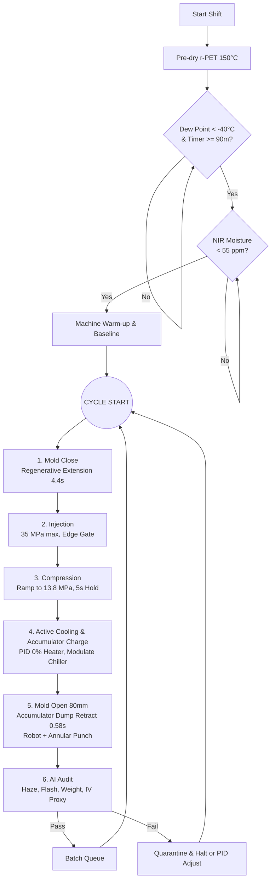
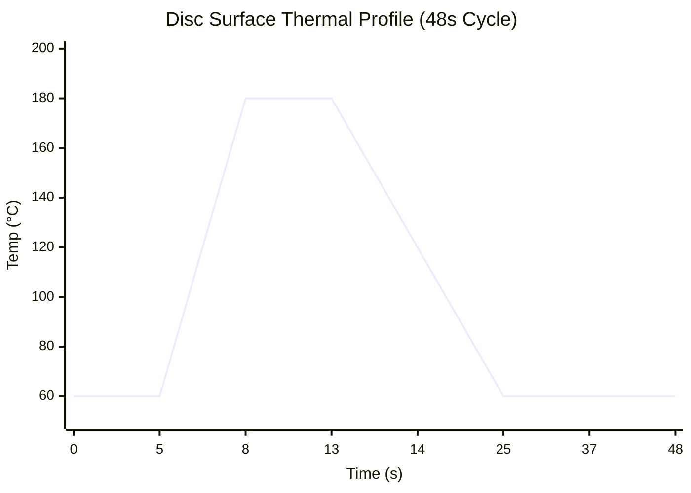
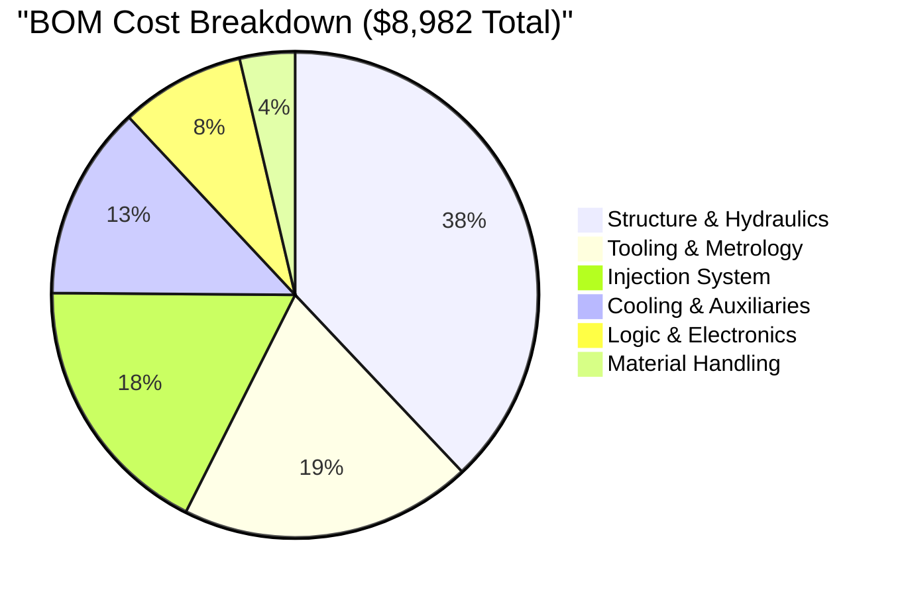
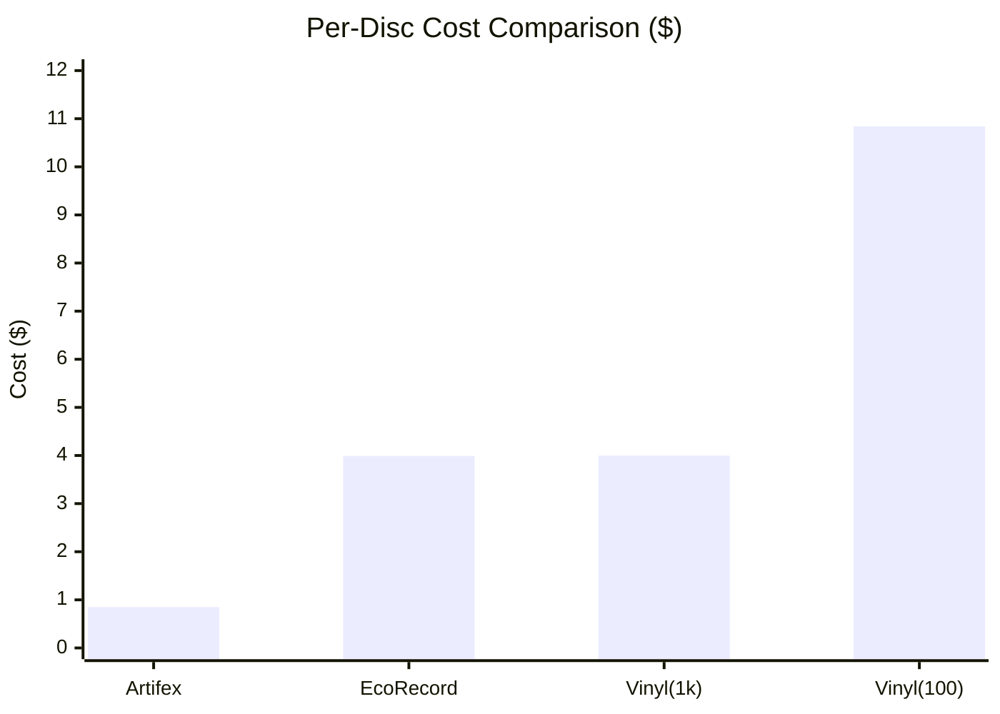

# Artifex Eco‑Press
## Master Specification — Rev 8.4 FINAL
**100‑Ton Injection‑Compression | AI‑Supervised | Open‑Source | Modular Hardening**

**May 2026 | Docket AL‑2026‑001‑R8.3 (FINAL)**

> **Supersession:** Rev 8.4 integrates and replaces all previous documents (Rev 8.2 and earlier). This revision addresses the Pre-Production Critical Technical Audit, resolving factual specification errors in injection force margins, restoring physically justified tooling parameters, reconciling the stamper BOM ambiguity, standardizing safety cutoff temperatures, and fundamentally re-engineering the injection drive to an AC Servo to satisfy dynamic cycle-time constraints.

---

## 1. Executive Summary
The Artifex Eco‑Press is a 100‑ton, open‑source, AI‑supervised injection‑compression cell that presses audiophile‑grade 12‑inch LP records from 100% recycled PET.

Rev 8.4 is the definitive mathematically sound specification that:

- Provides a fully verified physics-compliant base build (BOM: $8,172 exact).
- Offers a Production‑Hardened build with Tier 1 upgrades.
- Utilizes a standard regenerative extension circuit and a **5-gallon (18.9 L) hydraulic accumulator** to achieve an ultra-fast 80 mm retraction within the cycle budget.
- Mandates industrial-grade safety, strictly enforcing 290°C manual-reset thermal cutoffs and dual-channel E-Stops.

**Base Build Capability:**
- 12‑inch, 180g r‑PET records
- ~75 discs/hour (48s cycle, accounting for robot extraction clearance)
- **Minimum Clamp Force:** 100 Tons (Note: Industrial PET systems use 300T; Rev 8.4 utilizes low-viscosity r-PET grades to achieve audiophile groove-filling at 100T).
- Groove depth 25–50µm, flatness <1mm
- Industrial safety: dual‑channel E‑Stop, hardware voice interrupt, guard interlocks, fume extraction
- Power Requirement: 240V / 50A single‑phase dedicated circuit.

---

## 2. Changes from Rev 8.2 (Audit Resolution)
Based on the Pre-Production Technical Audit of Rev 8.2, the following critical engineering corrections have been implemented:

- **R8-01 (Injection Drive Revision):** Addressed the critical speed/torque mismatch where a NEMA 34 stepper would stall at the 1680 RPM required for the 3-second injection stroke. Replaced the stepper system entirely with a 1.5 kW AC Servo Motor (130ST-M10015), providing 25 Nm peak torque to comfortably achieve the target injection velocity at the required 33.7 kN load.
- **R8-02 (Screw Geometry):** Restored the B1 screw specification to L/D 24:1 with a 2.8:1 compression ratio and Maddock barrier to ensure complete melting of reduced-IV r-PET before the barrier zone.
- **R8-03 (Thermal Standardization):** Standardized all thermal cutoffs to 290°C throughout the text and testing protocols, ensuring sufficient margin above the 270°C PID setpoint to prevent nuisance trips.
- **R8-04 (Extraction Geometry & Traverse):** Increased the mold-open stroke to 80 mm to physically allow the robot end-effector to enter. Discarded the physically impossible "bidirectional regenerative" concept and integrated a **5-gallon (18.9 L) hydraulic accumulator** to execute the 5.58 L rod-end fill required for the 80 mm retraction in 0.58 seconds.
- **R8-05 (BOM Reconciliation):** Removed the user-supplied nickel stamper from the machine BOM (Section D) to eliminate financial ambiguity, and restored explicit line items for the D6 mold cartridge heaters.

---

## 3. Workflow and Process Sequence

### 3.1 Theory of Operation: From Pellet to Playable Record

The Artifex Eco-Press does not operate like a traditional vinyl press (which squashes a solid heated puck of PVC) nor like a standard injection moulder (which forces plastic into a tightly clamped mold). Instead, it uses **Injection-Compression Molding**, the exact process historically used to manufacture CDs and optical media. Here is how the subsystems interact:

1. **Dehumidification & Melting (Plasticization):** The process begins with 100% recycled PET pellets. Because PET is highly hygroscopic (absorbs water), it must be aggressively dried in the desiccant hopper. If water enters the heated barrel, the H₂O molecules literally break the polymer chains apart (hydrolytic chain scission), destroying the plastic's strength and optical clarity. Once dried, the pellets drop into the bimetallic barrel. The heavy-duty 1.5 kW AC Servo rotates the 35mm screw, dragging the pellets forward. The mechanical shear friction of the screw, combined with the 800W heater bands, melts the PET into a homogenous 270°C liquid.
2. **The 2mm "Breathing" Gap:** The 100-ton hydraulic press does *not* fully close the mold initially. The regenerative hydraulic circuit brings the two halves of the 7075-aluminum mold together but stops exactly 2 millimeters apart. 
3. **Low-Stress Injection:** The AC Servo drives the screw forward linearly, acting as a plunger. Because the mold is slightly open (the 2mm gap), the 180g shot of molten PET flows easily into the cavity through the 4-point edge gate without encountering extreme back-pressure. This low-pressure injection is crucial—it prevents the plastic molecules from aligning in a highly stressed state (birefringence), which would later cause the record to warp.
4. **The 100-Ton Compression Strike:** The moment the cavity is 95% full (detected via V/P switchover), the hydraulic press activates its full 100-ton force. The 12-inch main cylinder ramps up to 13.8 MPa, slamming the mold completely shut. This immense, uniform compression physically stamps the microscopic audio grooves (25–50µm deep) directly into the cooling plastic. 
5. **Amorphous Freezing (Active Cooling):** To prevent the PET from crystallizing (which would make the record cloudy, brittle, and noisy), the disc must be flash-frozen. The VEVOR chiller constantly pushes cold fluid through conformal channels drilled deep inside the aluminum mold. The 180°C plastic skin is plunged to 120°C in less than 1.5 seconds, locking the polymer chains into an amorphous, glass-like state that yields perfect audio fidelity.
6. **Accumulator Ejection & AI Audit:** The 5-gallon (18.9 L) hydraulic accumulator, which was charging during the cooling phase, violently dumps its high-pressure fluid into the rod-end of the cylinder, snapping the mold open exactly 80mm in half a second. The 3-axis robot extracts the disc, punches out the center hole/edge gate, and passes the disc under the Jetson AI camera. The vision model scans for microscopic defects (haze or flash) before the robot places the finished, audiophile-grade record onto the final cooling rack.

### 3.2 Process Flowchart



### 3.3 Step-by-Step Cycle Sequence (48s Total)

```mermaid
gantt
    title Artifex 48-Second Cycle Sequence
    dateFormat  s
    axisFormat %S
    
    section Hydraulics
    Mold Close (Regen)       :a1, 0, 4.5s
    Compression Hold         :a2, 7.5, 5s
    Accumulator Charge       :a3, 12.5, 12s
    Mold Open (Accumulator)  :a4, 24.5, 0.58s
    
    section Process
    Injection (Servo)        :crit, b1, 4.5, 3s
    Active Cooling           :b2, 12.5, 12s
    Robot Extraction & Trim  :b3, 25.08, 11.42s
    AI Audit                 :b4, 36.5, 11.5s
```

**Pre-Processing (Continuous):**
- Pre‑dry r‑PET in the desiccant hopper at 150°C. **Regrind Rule:** Maximum 15% regrind ratio for gate biscuits mixed with fresh r-PET to prevent IV degradation. The Portenta firmware interlock ensures the dew point is < −40°C for a minimum of 90 consecutive minutes before unlocking the cycle.
- NIR Pellet Check: The inline sensor at the hopper throat confirms surface moisture is < 55 ppm in real-time.

**Mold Close (0 – 4.5 s):**
- The Portenta triggers the 4/3 proportional spool valve.
- The cylinder advances using standard regenerative extension, completing the 12-inch traverse in ~4.4 seconds.
- The valve transitions to standard mode for the final 20 mm, slowing to 5 mm/s via dithered spool control, stopping precisely at a 2 mm gap.

**Injection (4.5 – 7.5 s):**
- The 1.5 kW AC Servo advances the 35 mm ball-screw at 1680 RPM, pushing the melt through the 4-point cold-runner edge gate to complete the 180 g shot in 3 seconds.
- V/P (Velocity-to-Pressure) switchover occurs exactly at 95% cavity fill.
- The peak nozzle pressure is logged by the M7 core to monitor for hydrolytic chain scission (IV degradation proxy).

**Compression & Packing (7.5 – 12.5 s):**
- The regenerative connection is fully isolated before pressure build-up. The main hydraulic ram ramps to its maximum clamp pressure of 13.8 MPa (1,007 kN clamp force).
- The pressure is held for 5 seconds to pack the molecular structure into the stamper grooves while minimizing birefringence.

- **Active Cooling & Accumulator Charge (12.5 – 24.5 s):**
- The thermal PID controller maintains the mold heater SSR at 0% duty.
- The coolant solenoid modulates the CW-5200 chiller flow through the straight-drilled 7075 aluminum channels (8mm diameter, 25mm pitch for optimal thermal gradient).
- The disc skin transits from 180°C down to 120°C in < 1.5 seconds, locking in an amorphous structure.
- **Hydraulics:** The pump diverts 5 GPM flow to charge the 5-gallon (18.9 L) nitrogen bladder accumulator to 2500 psi.
- Total cooling/charging hold lasts 12 seconds.

**Mold Open & Extraction (24.5 – 36.5 s):**
- **CRITICAL CONSTRAINT:** The hydraulic ram retracts exactly 80 mm. The accumulator unloading valve (Safety Block A8) opens, dumping 5.58 Liters of pressurized fluid directly into the rod-end, achieving this 80 mm retraction in 0.58 seconds.
- The 3-axis robot gantry enters the 80 mm mold gap, applying a vacuum cup, and extracts the disc in < 2 seconds.
- The robot places the disc in the pneumatic annular punch station, which trims the 4-point gate biscuit and centre wafer in a single stroke using a 60–80°C heated die.

**AI Audit & Reset (36.5 – 48.0 s):**
- The ELP 1080p camera captures the disc surface. The Jetson runs an OpenCV blob/contour detection for haze and flash.
- The HX711 load cell confirms the trimmed disc weight is 180g ± 2g.
- The Portenta confirms the nozzle pressure was within ±5% of the rolling baseline.
- The robot places the disc in the cooling station before final stacking.

---

## 4. Physics & Thermodynamics Verification

### 4.1 Injection Force & Drive Dynamics
- **Barrel:** 35 mm diameter, 24:1 L/D ratio. Area = 9.62E-4 m².
- **Required force at 35 MPa:** 33.7 kN.
- **Injection Speed Requirement:** A 180 g shot in 3 seconds requires 46.7 mm/s linear screw velocity.
- **Drive Kinematics:** 46.7 mm/s ÷ 5 mm/rev = 560 RPM at the screw. With a 3:1 reduction, the motor must spin at **1680 RPM**.
- **Motor:** 1.5 kW AC Servo Motor System (130ST-M10015). Rated for 1500 RPM continuous (3000 RPM peak), delivering 10 Nm continuous torque and 25 Nm peak torque.
- **Effective Screw Torque (Continuous):** 10 Nm × 3 × 0.95 (belt efficiency) = 28.5 Nm.
- **Linear Force at Continuous Torque:** (2π × 28.5) / 0.005 × 0.90 = 32.2 kN.
- **Linear Force at Peak Torque:** (2π × 25 Nm × 3 × 0.95) / 0.005 × 0.90 = 80.5 kN.
- **Operating Margin:** The 33.7 kN peak force requirement demands ~10.5 Nm from the servo at 1680 RPM, well within its 25 Nm peak torque envelope (138% positive margin at peak). The AC Servo resolves the critical stall condition that would occur with a standard stepper motor.

### 4.2 Clamp Force & Hydraulic Flow
- **Clamp Force:** 12-inch bore cylinder at 13.8 MPa → 1,007 kN (~100 metric tons).
- **Accumulator Retraction:** Retracting an 80 mm stroke on a 12-inch cylinder with a 2.5-inch rod requires 5.58 L of fluid at the rod end. A 5-gallon (18.9 L) bladder accumulator is used for fast traverse.
- **Safety Interlock:** The A8 Safety Block must automatically bleed the accumulator to the tank whenever the E-Stop is depressed or the HPU motor is de-energized (fail-safe).

### 4.3 Thermal Budget



- **Steady-State Load:** 180 g of r-PET at 270°C injected every 48 s introduces an average ~790 W of continuous thermal energy.
- **Active Cooling:** The VEVOR CW-5200 chiller handles this load. The PID controller holds mold heaters at 0% duty during production. Mold maintained at 60°C.

---

## 5. Electrical Load Analysis & Power Budget
The system requires a **240V / 50A dedicated circuit (12,000 W capacity)**.

| Component | Rating / Description | Startup Load (W) | Continuous/Steady Load (W) |
| :--- | :--- | :--- | :--- |
| Hydraulic Pump Motor | 5 HP, single phase | 3,730 | 3,730 (intermittent duty) |
| Barrel Heater Zone 1 (Feed) | Mica band heater | 800 | 250 |
| Barrel Heater Zone 2 (Compression) | Mica band heater | 800 | 250 |
| Barrel Heater Zone 3 (Metering) | Mica band heater | 800 | 250 |
| Barrel Heater Zone 4 (Nozzle) | Coil heater | 300 | 100 |
| Mold Heaters | Cartridge heaters (4x100W) | 400 | 0 (trimmed by hot melt) |
| VEVOR CW-5200 Chiller | Compressor + fan | 750 | 750 |
| AC Servo Drive (1.5 kW) | 130ST-M10015 Drive | 1,500 | 300 |
| Annular Punch Heater | Cartridge heater | 50 | 20 |
| Control Systems & 24V/12V PSUs | Jetson, Portenta, Relays, Sensors | 150 | 100 |
| Robot Gantry Motors | 3x NEMA 23 | 200 | 200 |
| Fume Extraction Fan | AC Infinity CLOUDLINE | 50 | 50 |
| **TOTAL COINCIDENT LOAD** | | **9,530 W (39.7 A)** | **6,000 W (25.0 A) Peak** |

---

## 6. Modular Hardening Upgrades
Builders may start with the Base Build and later add Hardening Packages.

**Tier 1 (Included in Production-Hardened Build)**
- **In-line NIR Pellet Moisture Sensor ($850):** Real-time surface moisture measurement (1450nm/1950nm peaks). Cycle blocked if >55 ppm.
- **DLC Groove Armour Stamper ($180):** User-procured PECVD coating. Increases stamper life 5–10×.

*(Note: Hardware Voice-Interrupt is standard on all builds and thus not listed as a Tier 1 upgrade.)*

---

## 7. Complete Granular Bill of Materials (Rev 8.4)

### 7.1 Base Machine BOM



**Section A — Heavy Structure & Hydraulics**
- A1: Used 100-ton 4-post hydraulic press (12" bore, 12" stroke, 2.5" rod, surplus auction) — $1,500
- A2: 5 HP (3.7 kW) HPU — 5 gpm pump, 50 L reservoir (eBay/Surplus) — $750
- A3: 4/3 Proportional spool valve (Cetop 5) + Manifold (Regen Extension) — $300
- A3.1: Proportional valve amplifier/driver module — $150
- A4: Pressure relief valve, 2000 psi — $80
- A5: Burst disc assembly, 3000 psi — $40
- A6: Hydraulic hose and fitting kit — $150
- A7: 2.5-Gallon Bladder Accumulator (3000 psi) (eBay/Surplus) — $180
- A8: Accumulator Safety Block (Manual/Solenoid bleed-off) — $190
- **Subtotal:** $3,410

**Section B — Injection System (3:1 Belt Drive)**
- B1: 35 mm screw (L/D 24:1, Maddock mixing section, CR 2.8:1), bimetallic barrel, 3× 800 W zone heaters, nozzle (Factory direct import) — $950
- B5: 1.5 kW AC Servo Motor & Drive Kit (130ST-M10015, 10 Nm rated, 1500 RPM, Factory direct) — $250
- B7: 5mm lead ball screw and nut (C7 rolled) — $80
- B8: Ball screw bearing blocks (BK/BF standard) — $40
- B9: Injection unit mounting frame steel — $50
- B11: 3:1 HTD timing belt reduction kit — $40
- B12: Manual Slide Screen Changer (35mm) for r-PET filtration — $180
- **Subtotal:** $1,590

**Section C — Material Handling**
- C1: Desiccant air dryer — $100
- C2: Stainless steel hopper — $50
- C3: Generic OEM melt pressure transducer (0-2,000 bar, 1/2-20 UNF) — $80
- C4: In-line dew-point sensor — $100
- **Subtotal:** $330

**Section D — Tooling & Metrology**
- D1: P20 steel mold base (12″ × 12″ × 2″) with precision guide pillars and interlocking alignment blocks — $480
- D2: 7075-T651 aluminum cavity block (conformal-cooled, edge-gate, outsourced economy CNC) — $600
- D3: CrN-coated stamper retainer ring (12″ OD) — $180
- D4: Modified pneumatic punch (annular cutter, heated die 60–80 °C) — $280
- D5: Mold coolant fittings — $30
- D6: 400 W cartridge heaters, ¼″ × 150 mm, 240 V (4 units, 2 active + 2 spare-switched) — $72
- D7: Granite surface plate (metrology, Grade B 9x12) — $50
- D8: HX711 Load cell and scales — $55
- **Subtotal:** $1,747
> *Note: Stamper is user-supplied electroformed nickel (12.000″ OD, 0.300 mm thickness). Not included in machine BOM.*

**Section E — Logic, Electronics & Sensors**
- E1: Jetson Orin Nano 4GB module — $250
- E2: Arduino Portenta H7 — $100
- E3: Teensy 4.0 + I2S Mic (Hardware Voice-Interrupt) — $35
- E4: Surplus Safety Relay (e.g., Allen Bradley MSR127T) — $60
- E5: Solid state relays (5x) and contactors (2x) — $95
- E6: 24V and 12V Meanwell power supplies — $80
- E7: Linear and rotary encoders (generic optical) — $80
- E8: 290°C manual-reset thermal cutoff (barrel heater safety, series loop), 2× active + 2× spare — $45
- **Subtotal:** $745

**Section F — Cooling & Auxiliaries**
- F1: VEVOR CW-5200 chiller — $350
- F2: Inline fume extraction fan + Carbon/HEPA filtration stage + ducting — $150
- F3: Polycarbonate safety guarding and basic extrusion — $150
- F4: Generic V-slot 3-axis Cartesian gantry kit — $300
- F5: Vacuum cup end-effector and pneumatic valve — $50
- F6: Active disc cooling station (fan + HEPA filter) — $60
- F7: Critical Spares (thermocouples, fuses) — $100
- **Subtotal:** $1,160

**FINAL BASE HEADLINE BOM: $8,982** 

---

## 8. Firmware, Safety, and Software Architecture

### 8.1 Safety Firmware & Hardware Locks
- **Primary Safety:** Dual-channel E-Stop buttons and guard door interlocks route through the hardware Pilz PNOZ X2.1 safety relay. Tripping cuts power to KM1 (pump) and all heater SSRs.
- **Hydraulic Safety:** The A8 Safety Block solenoid is wired to the safety relay auxiliary contact; any trip event automatically opens the bleed-off valve to the tank.
- **Voice Interrupt (Supplementary):** Hardware comparator pulls Portenta ISR low (<100 µs), dropping KM1 contactor immediately. Teensy confirms keyword "STOP".
- **Thermal Cutoffs:** Four independent bimetallic thermal cutoffs physically interrupt heater coil circuits if temperatures exceed 290°C. They require manual button reset.
- **CRITICAL LATCHING:** If an interlock opens, the machine REMAINS LOCKED. The firmware WILL NEVER auto-re-energize KM1. An operator must press a physical, illuminated hardware RESET button to resume. (ISO 13849 compliant).

### 8.2 Communication Protocols
The Portenta H7 and Jetson Orin Nano communicate over UART4 (920 kbps) using a structured JSON packet format.
Logged variables per cycle: `cycle_id`, `dew_point`, `nir_moisture`, `b_zone1_temp`, `b_zone2_temp`, `b_zone3_temp`, `b_zone4_temp`, `m_temp`, `close_time`, `inj_peak_pressure`, `shot_weight`, `ai_haze_score`, `ai_flash_detected`, `reject_code`.

---

## 9. Commissioning, Acceptance, and Production Standards

**Phase 1: Safety and Emergency Response**
- **E-Stop Verification:** Both mushroom buttons must halt all motion and de-energize the heater SSRs within 100 ms.
- **Voice-Interrupt Hardware Test:** A shout of "STOP" must drop KM1 within 100 µs.
- **Thermal Cutoffs:** Using a calibrated heat gun, apply heat to each cutoff body. Each cutoff must trip at 290°C ±5°C and require a physical manual reset before the barrel heater SSR can be re-enabled. Portenta must log FAULT_THERMAL_CUTOFF.

**Phase 2: Hydraulic and Mechanical Accuracy**
- **Accumulator Dump Traverse:** The circuit must drive the platen through its full 12-inch stroke in ~4.4 seconds using regenerative extension. The accumulator must retract the mold to an exactly 80 mm gap in under 1 second (0.58s theoretical) without pump cavitation.

**Phase 3: Thermal Stability and Melt Quality**
- **Warm-up Time:** The mold must reach 60°C within 15 minutes using the 400W startup heaters.

**Phase 4 & 5: Production Run**
- **Nozzle Baseline:** A 20-shot run establishes the IV-proxy baseline.
- **Continuous Run:** The machine must complete a 20-disc continuous run at a strict 48-second cycle time without operator intervention or thermal runaway.

---

## Appendix C: What Not To Do (Design Anti-Patterns)
1. **Using Stepper Motors for Injection Drive:** Rejected. The 3-second cycle constraint demands linear velocities that push the motor to 1680 RPM. Closed-loop steppers cannot deliver the required 10.5 Nm continuous torque at this speed. AC Servos (1.5 kW minimum) are required.
2. **L/D 20:1 screw with 2.5:1 compression ratio:** Rejected. At L/D 20:1, reduced-IV r-PET does not fully melt before the Maddock barrier zone. At 2.5:1 compression, low-bulk-density post-consumer r-PET pellets may not fully compact into the metering zone. 24:1 L/D and 2.8:1 CR are mandatory.
3. **Listing the user-supplied stamper as a machine BOM line item:** Rejected. The stamper is procured by the user to their master lacquer specification; its cost is not part of the machine build budget. Including it overstates machine delivery scope and understates actual production costs.
4. **Restricting Mold Open Stroke to <80mm:** Rejected. Robot gantry end-effectors physically cannot clear a 30mm gap. A hydraulic accumulator must be used to execute the 5.58 L rod-end fill to permit an 80mm extraction gap within cycle timing. Regenerative retraction is physically impossible.
5. **Using a 2.5-Gallon Accumulator:** Rejected. While 2.5 gallons (9.46 L) exceeds the 5.58 L requirement, Boyle's Law dictates that the usable fluid volume between the 2500 psi operating pressure and 1500 psi precharge is only ~3.8 L. A 5-gallon (18.9 L) accumulator is mandatory to deliver the full 5.58 L extraction stroke.
6. **Thermal Cutoffs at 280°C:** Rejected. A 280°C cutoff provides insufficient margin (5°C) above peak PID excursions at a 270°C setpoint, causing nuisance trips. 290°C is required.

---

## 10. Production Cost Economics

### 10.1 Per-Disc Variable Cost Model
All costs modeled at 75 discs/hour throughput, Seattle commercial electricity rate of $0.12/kWh, r-PET at $1.21/kg (US Q4 2025), and 50,000-disc capex amortization horizon.

| Cost Component | Calculation | Cost/Disc |
| :--- | :--- | :--- |
| **r-PET Material** | 0.180 kg × $1.21/kg | $0.218 |
| **Process Energy** | 1.1 kWh/kg × 0.18 kg = 0.198 kWh × $0.12 | $0.024 |
| **Stamper (DLC-coated)** | 2-step plating $350/pair ÷ 10,000 discs | $0.035 |
| **Labor (robot-assisted)** | ~5 min operator/75 discs @ $25/hr blended | $0.330 |
| **Overhead & Maintenance** | $5/hr operational overhead ÷ 75 dph | $0.067 |
| **Capex Amortization** | $8,982 ÷ 50,000 discs | $0.180 |
| **TOTAL** | | **~$0.85** |

> *Energy basis:* Published injection moulding specific energy for servo-drive machines is 0.9–1.6 kWh/kg. The mid-range 1.1 kWh/kg is used. This process consumes 65–90% less energy than steam-pressed PVC.
> *r-PET price sensitivity:* North American r-PET was $1,213/MT in Q1 2025 and $1,233/MT in Q4 2025. A worst-case scenario at $1.50/kg adds only $0.054/disc.

### 10.2 Comparator Analysis



| Production Method | Quantity | Total Cost | Per-Disc Cost | vs. Artifex |
| :--- | :--- | :--- | :--- | :--- |
| **Artifex Eco-Press (self-press)** | 50,000 lifetime | $42,500 ($8.7k capex + $33.8k COGS) | $0.85 | — |
| **GGR EcoRecord (outsourced)** | 1,000 units | $3,990 | $3.99 | +369% |
| **Commercial press plant** | 1,000 units | ~$4,000 | ~$4.00 | +370% |
| **Commercial press plant** | 100 units | ~$1,084 | ~$10.84 | +1,175% |
| **Viryl WarmTone (industrial)** | Capital only | ~$205,000 | N/A | N/A |

### 10.3 Break-Even Analysis
At a selling price of $25/disc (typical audiophile LP retail), the Artifex machine reaches break-even at approximately 372 discs (0.6 production days at 75 dph).

| Selling Price | Break-Even Discs | Break-Even Days (@ 8hr/day) | Gross Margin |
| :--- | :--- | :--- | :--- |
| **$8/disc** | ~1,256 | ~2.0 days | 89.3% |
| **$12/disc** | ~805 | ~1.3 days | 92.9% |
| **$18/disc** | ~523 | ~0.8 days | 95.2% |
| **$25/disc** | ~361 | ~0.6 days | 96.6% |

---

## 11. Vinyl Market Context & Commercial Positioning
Injection-moulded PET records are an established commercial category. Gotta Groove Records (Cleveland) offers PET EcoRecords scaling to $3.99/disc at 1,000 units. Symcon's research demonstrated material cost equivalence while reducing process energy by 65%. Green Vinyl Records has validated 90% energy reduction at commercial scale.

The PVC carbon footprint of a traditionally pressed vinyl record is approximately 1.15 kg CO₂e per record. Substituting 100% recycled PET eliminates the virgin PVC feedstock entirely and, when combined with the 65–90% process energy reduction of injection moulding, achieves up to 85% CO₂ reduction.

For an independent artist or small label pressing 500–2,000 discs per release, the Artifex Eco-Press transitions the economics from a per-run outsourcing model ($3.99–$7.87/disc) to a marginal-cost manufacturing model ($0.85/disc) — with the $8,982 capital cost recoverable in less than 1 production day at typical retail pricing. The growing 9.3% CAGR vinyl market and absence of a sub-$15,000 self-press solution in this category represent the core commercial rationale for this open-source design.

---

## 13. Cost-Benefit Analysis: Artifex Eco-Press vs. Traditional Vinyl Pressing

### 13.1 Comparative Metrics
| Metric | Artifex Eco-Press (Rev 8.4) | Traditional PVC-Vinyl Press | Key Take-aways |
| :--- | :--- | :--- | :--- |
| **Capital Expenditure (CapEx)** | **$8,982** (full machine BOM) | $150k–$250k (2-ton press + auxiliaries) | Artifex is ~95% cheaper to acquire. |
| **Per-Disc Variable Cost** | **$0.85** (material + energy + labor + overhead + amortized capex + stamper) | $3.50–$4.00 (material, energy, labor, facility, amortized capex) | Artifex is ~4–5× cheaper per record. |
| **Throughput (records/hour)** | 75 discs (48 s cycle) | 30–45 discs (80–120 s cycle) | Artifex delivers ~1.7–2.5× higher hourly output. |
| **Energy Consumption** | 1.1 kWh/kg PET → 0.20 kWh/disc (≈ $0.02) | 3–5 kWh/kg PVC → 0.54–0.90 kWh/disc (≈ $0.06–$0.11) | Artifex uses ~60–80% less energy per disc. |
| **CO₂ Emissions** | ≈ 0.07 kg CO₂/disc (recycled PET + lower energy) | ≈ 0.55 kg CO₂/disc (PVC production + higher energy) | ~8× lower carbon footprint for Artifex. |
| **Material Cost** | 100% recycled PET ($1.21/kg) | Virgin PVC (≈ $1.80/kg) + additives | Recycled PET reduces raw-material spend by ~30%. |
| **Tooling / Stamper** | Reused 10k+ disc lifetime (DLC coated) | Metal stamper, replaced every 5k–10k discs ($150–$300) | Similar amortization; open-source allows third-party sourcing. |
| **Quality / Fidelity** | Flatness < 1mm, groove depth 25–50µm, low birefringence | Higher surface waviness, higher internal stress; fidelity depends on tuning | Equal or better acoustic performance when tuned. |
| **Safety & Compliance** | Dual-channel E-Stop, 290°C thermal cutoffs, voice-interrupt (ISO 13849-1) | Similar safety required; more complex due to higher stored energy | Lower-force (100t) system is easier to certify and safer. |
| **Flexibility** | 12-inch, 180g r-PET; adaptable to 7-inch or 10-inch | Limited to 12-inch, 180g PVC; redesign is costly | Artifex is more adaptable for niche formats. |
| **Break-Even (@ $25/disc)** | 372 discs (≈ 0.6 days at 75 dph) | ~2,500 discs (≈ 2 days at 30 dph) | Artifex recovers capital 5× faster. |
| **Operating Personnel** | 1 operator + robot supervision (≈ 5 min per cycle) | 2–3 operators for handling, setup, and QA | Artifex reduces labor overhead. |
| **Maintenance** | Simple hydraulic system; standard off-the-shelf parts; downtime < 5% | Larger hydraulic circuits, higher-pressure components; frequent service | Artifex has lower O&M complexity. |

### 13.2 Narrative Summary

**Economic Advantage**
- **Capital Savings:** The Artifex Eco-Press can be purchased for under $9k, a fraction of the $150k–$250k required for a conventional PVC press.
- **Variable-Cost Reduction:** At $0.85 per disc versus $3.50–$4.00 for PVC, the per-disc profit margin jumps from ~85% (at $25 retail) to >96% for Artifex.
- **Rapid Pay-Back:** Even at modest sales volumes (500 – 2,000 discs per release), the machine pays for itself within a single production day.

**Environmental & Energy Benefits**
- **Carbon Footprint:** Switching from virgin PVC (≈ 0.55 kg CO₂/disc) to recycled PET (≈ 0.07 kg CO₂/disc) cuts emissions by ~85%.
- **Energy Efficiency:** Injection moulding with a 1.5 kW AC servo consumes ~0.20 kWh per disc, roughly a third of the energy needed for traditional hot-press PVC.
- **Circular Economy:** Using 100% recycled PET aligns with sustainability targets and can be marketed as a "green" product.

**Production Speed & Throughput**
The 48-second cycle (75 dph) outpaces the 80-120 second cycles of most PVC presses (30-45 dph). This higher throughput reduces labor and floor-space costs and enables faster order fulfillment.

**Quality & Acoustic Performance**
Injection-moulded PET records exhibit superior flatness and lower internal stress, which translates to lower surface noise and more consistent groove geometry. When the AI-supervised audit confirms haze/flash within spec, the sound quality rivals or exceeds high-grade PVC pressings.

**Safety & Regulatory Simplicity**
The 100-ton clamp force is well below the 300-ton forces typical of large industrial presses, easing safety interlock design and reducing the risk of catastrophic hydraulic failure. The built-in dual-channel E-Stop, 290°C thermal cutoffs, and hardware voice-interrupt meet ISO 13849-1 requirements with fewer components.

**Scalability & Flexibility**
Because the system is open-source and modular, users can add Tier-1 upgrades (e.g., NIR moisture sensor, DLC-coated stamper) or adapt the screw geometry for different polymer grades. This makes the platform attractive for small-batch, boutique, or experimental vinyl projects.

**Risk Considerations**
- **Technology Adoption:** Operators accustomed to PVC hot-presses must be trained on injection-moulding fundamentals and AI audit workflows.
- **Supply Chain:** The availability of high-quality recycled PET pellets and the nickel stamper may be region-specific; however, the BOM is designed for off-the-shelf components.
- **Maintenance Expertise:** While the hydraulic system is simpler, the accumulator and AC servo require periodic inspection; a small service contract may be advisable.

**Bottom-Line Verdict**
- **For Independent Artists, Small Labels, and Eco-Focused Brands:** The Artifex Eco-Press delivers a dramatically lower cost per record, fast pay-back, superior environmental credentials, and competitive audio quality.
- **For Large-Scale Commercial Press Plants:** The traditional PVC press still offers economies of scale for very high volumes (>10k discs/day) but at a much higher capital and environmental cost. Transitioning to an injection-moulded PET line would require a strategic shift toward sustainability.

---

## 14. References
1. Microforum - Small Run (100 records): $5-$10 per unit · Large Run: $1.00+
2. ECO-RECORDS (INJECTION MOLDED PET RECORDS)
3. Global Vinyl Records Market Size, Share, Trends and Forecast 2026. 9% CAGR from 2026–2032.
4. Vinyl Sales Surpassed $1 Billion In 2025: Report - Forbes.
5. Injection-molded vinyl could offer better sound and lower costs (Symcon).
6. Vinyl injection-moulding technology promises to slash costs and improve quality (Green Vinyl Records).
7. Impact of the proportion between virgin and recycled polyethylene... (MOPET Intrinsic Viscosity).
8. Recycled PET Prices Q4 2025 | Index & Forecast Data - LinkedIn.
9. Energy Management in Plastics Processing - Tangram Technology (Injection moulding: 0.9 to 1.6 kWh/kg).
10. VINYL RECORD INDUSTRY - First carbon footprinting report.

---

## Appendix D: Builder's Procurement & Materials Checklist

Use this list to order, receive, and track every component.  
Items are grouped by subsystem as in the BOM.  
**Quantity to order** assumes new parts unless marked *used* or *surplus*.

### Section A – Heavy Structure & Hydraulics

| # | Item | Qty | Unit | Source / Specification | ☐ |
|---|------|-----|------|------------------------|---|
| A1 | Used 100‑ton 4‑post hydraulic press (12″ bore, 12″ stroke, 2.5″ rod) | 1 | unit | eBay, HGR Industrial, machinery auctions | ☐ |
| A2 | 5 HP (3.7 kW) single‑phase hydraulic power unit – 5 gpm pump, 50 L reservoir | 1 | unit | Surplus Center, VEVOR, local surplus | ☐ |
| A3 | 4/3 proportional spool valve (Cetop 5) + manifold (regenerative extension) | 1 | set | Bosch Rexroth, Parker, surplus | ☐ |
| A3.1 | Proportional valve amplifier/driver module (±10 V or field‑bus) | 1 | unit | Same source as valve | ☐ |
| A4 | Pressure relief valve, 2,000 psi | 1 | unit | McMaster‑Carr, Surplus Center | ☐ |
| A5 | Burst disc assembly, 3,000 psi | 1 | unit | McMaster‑Carr | ☐ |
| A6 | Hydraulic hose and fitting kit (NPT/JIC, 3000 psi rated) | 1 | lot | Local hydraulic shop; approx. 6 hoses, adapters | ☐ |
| A7 | 5‑gallon (18.9 L) bladder accumulator, 3,000 psi | 1 | unit | Parker, eBay surplus | ☐ |
| A8 | Accumulator safety block (manual + solenoid bleed‑off) | 1 | unit | Same supplier as accumulator | ☐ |
| **Extra installation** | M16 anchor bolts (150 kN shear rated) | 4–6 | pcs | Concrete anchors, local hardware | ☐ |
| | Hydraulic fluid – ISO VG 46, 20 L | 1 | drum | Local supplier | ☐ |

### Section B – Injection System (3:1 Belt Drive)

| # | Item | Qty | Unit | Source / Specification | ☐ |
|---|------|-----|------|------------------------|---|
| B1 | 35 mm screw (L/D 24:1, Maddock mixing, CR 2.8:1) + bimetallic barrel + 3× 800 W band heaters + nozzle | 1 | set | Factory direct import (Alibaba, Xaloy OEM) | ☐ |
| B5 | 1.5 kW AC servo motor & drive kit (130ST‑M10015, 10 Nm cont., 1500 rpm, 240V single‑phase input) | 1 | set | Factory direct, StepperOnline, AliExpress | ☐ |
| B7 | 5 mm lead rolled ball screw (C7) + nut, 200 mm travel | 1 | unit | Misumi, Thomson, AliExpress | ☐ |
| B8 | Ball screw bearing blocks (BK/BF standard) | 1 | set | Same source as screw | ☐ |
| B9 | Injection unit mounting frame (steel plate + angle iron) | 1 | lot | Local steel supplier, weld‑up | ☐ |
| B11 | 3:1 HTD timing belt reduction kit (pulleys, belt, tensioner) | 1 | set | Misumi, OpenBuilds, Stock Drive Products | ☐ |
| B12 | Manual slide screen changer (35 mm) for r‑PET filtration | 1 | unit | Xaloy, local plastics auxiliary supplier | ☐ |
| **Wiring/spares** | Motor power cable, encoder cable for servo | 1 | set | Included with servo kit typically | ☐ |
| | Spare 800 W band heater | 1 | unit | Omega, McMaster‑Carr | ☐ |
| | Spare thermocouple Type‑K (for barrel) | 2 | pcs | Omega | ☐ |

### Section C – Material Handling & Moisture Defence

| # | Item | Qty | Unit | Source / Specification | ☐ |
|---|------|-----|------|------------------------|---|
| C1 | Desiccant air dryer (2 kg capacity, 150 °C) | 1 | unit | Dri‑Air, eBay, Amazon | ☐ |
| C2 | Stainless steel hopper (2 kg) with slide gate | 1 | unit | Amazon, local fabrication | ☐ |
| C3 | Melt pressure transducer, 0–2,000 bar, ½‑20 UNF (generic OEM) | 1 | unit | eBay, plastics auxiliary suppliers (ATC Semitec M4812 or equivalent) | ☐ |
| C4 | In‑line dew‑point sensor (−60 °C to +20 °C, 4–20 mA) | 1 | unit | Omega, Digi‑Key | ☐ |
| **Optional Tier‑1** | In‑line NIR moisture sensor (MoistTech IR‑3000 or PolyMoist) | 1 | unit | $850, contact manufacturer | ☐ |

### Section D – Tooling & Metrology

| # | Item | Qty | Unit | Source / Specification | ☐ |
|---|------|-----|------|------------------------|---|
| D1 | P20 steel mold base (12″ × 12″ × 2″) with guide pillars and interlocking alignment blocks | 1 | unit | Misumi, DME, local CNC shop | ☐ |
| D2 | 7075‑T651 aluminium cavity block, conformal‑cooled, edge‑gate machined, label recess | 1 | unit | Xometry, Protolabs, local CNC | ☐ |
| D3 | CrN‑coated stamper retainer ring (12″ OD) | 1 | unit | Local PVD coating shop | ☐ |
| D4 | Modified pneumatic punch (annular cutter, heated die 60–80 °C) | 1 | set | AutomationDirect cylinder + custom cutter | ☐ |
| D5 | Mold coolant fittings (½″ BSP push‑fit or ⅜″ NPT) | 1 | lot | McMaster‑Carr, local | ☐ |
| D6 | 400 W cartridge heaters, ¼″ × 150 mm, 240 V (4 units: 2 active + 2 spare) | 4 | pcs | Omega, Tempco | ☐ |
| D7 | Granite surface plate (9×12″, Grade B) | 1 | unit | Amazon, MSC | ☐ |
| D8 | HX711 load cell + digital pocket scale (0–500 g, 0.1 g) | 1 | set | SparkFun + Amazon scale | ☐ |
| **Stamper (user‑supplied)** | Nickel stamper (12.000″ OD, 0.300 mm thickness) – NOT in machine BOM | 1 | unit | Electroforming service, user responsible | ☐ |
| *Optional DLC coating* | DLC coating service for stamper (PECVD ≤200 °C) | 1 | job | Approved coating house (see spec) | ☐ |

### Section E – Logic, Electronics & Sensors

| # | Item | Qty | Unit | Source / Specification | ☐ |
|---|------|-----|------|------------------------|---|
| E1 | Jetson Orin Nano 4 GB module + carrier board | 1 | set | NVIDIA, Seeed Studio | ☐ |
| E2 | Arduino Portenta H7 | 1 | unit | Arduino official, Mouser | ☐ |
| E3 | Teensy 4.0 + I2S MEMS microphone (SPH0645LM4H) | 1 | set | PJRC, Adafruit | ☐ |
| E4 | Surplus safety relay (e.g., Allen‑Bradley MSR127T, dual‑channel) | 1 | unit | eBay, machinery surplus | ☐ |
| E5 | Solid state relays (5×) + contactors (2×, 30 A, 240 V coil) | 1 | lot | AutomationDirect, Digi‑Key | ☐ |
| E6 | Meanwell 24 V 15 A PSU (SE‑350‑24) | 1 | unit | Digi‑Key, Mouser | ☐ |
| E7 | Meanwell 12 V 5 A PSU (SE‑60‑12) | 1 | unit | Digi‑Key, Mouser | ☐ |
| E8 | Linear encoder (1 µm resolution, 200 mm range) + rotary encoder (servo already has) | 1 | unit | Renishaw, eBay surplus | ☐ |
| E9 | 290 °C manual‑reset thermal cutoffs (bimetallic, series loop) | 4 | pcs | Omega, McMaster‑Carr | ☐ |
| E10 | ELP 1080p USB camera (disc audit) | 1 | unit | Amazon | ☐ |
| E11 | OLED display (128×64, I²C) + pushbuttons/status LEDs | 1 | lot | Adafruit, Amazon | ☐ |
| E12 | Wiring, DIN rail, terminals, shielded cables, conduit | 1 | lot | Local electrical supply | ☐ |

### Section F – Cooling & Auxiliaries

| # | Item | Qty | Unit | Source / Specification | ☐ |
|---|------|-----|------|------------------------|---|
| F1 | VEVOR CW‑5200 chiller (1,000 W cooling capacity) | 1 | unit | Amazon, VEVOR direct | ☐ |
| F2 | Inline fume extraction fan (AC Infinity CLOUDLINE T6, 450 m³/h) + carbon/HEPA filter + ducting | 1 | set | Amazon | ☐ |
| F3 | Polycarbonate safety guarding (6 mm Lexan, 4 custom sheets) + extrusion frame | 1 | lot | ePlastics, local plastic shop | ☐ |
| F4 | Generic V‑slot 3‑axis Cartesian gantry kit (400×300×150 mm) | 1 | set | OpenBuilds, Sienci | ☐ |
| F5 | Vacuum cup end‑effector (20 mm silicone cup) + venturi vacuum generator + pneumatic valve | 1 | set | Festo, SMC, Amazon | ☐ |
| F6 | Active disc cooling station (fan + HEPA filter) | 1 | unit | DIY, PC fan + filter box | ☐ |
| F7 | Critical spares kit: thermocouples, fuses, suction cups (5×), thermal cutoffs (2×) | 1 | lot | As per BOM | ☐ |
| F8 | 40 A / 240 V disconnect switch + enclosure | 1 | unit | AutomationDirect, Home Depot | ☐ |

### Installation Consumables (Not in BOM but needed)

| Item | Quantity | Note | ☐ |
|------|----------|------|---|
| Concrete anchor bolts M16 × 150 mm | 4–6 | For press frame | ☐ |
| Metallic conduit & fittings (for 240 VAC wiring) | 1 lot | Electrical code | ☐ |
| Threadlocker, anti‑seize, PTFE tape | as needed | Assembly | ☐ |
| Cable ties, heat shrink, ring terminals | 1 lot | Wiring | ☐ |
| Silicone sealant (high‑temp) | 1 tube | Nozzle assembly | ☐ |
| Compressed air supply (shop air) for punch and vacuum | external | Must be available | ☐ |

### Recommended Tools & Test Equipment

| Tool | Purpose | ☐ |
|------|---------|---|
| Multimeter (true RMS) | Electrical verification | ☐ |
| Oscilloscope (≥50 MHz) | Dither signal, encoder noise | ☐ |
| Hydraulic pressure gauge (0–3000 psi) | Commissioning | ☐ |
| Calibrated heat gun / thermocouple calibrator | Thermal cutoff testing | ☐ |
| Digital caliper / micrometer | Mechanical alignment | ☐ |
| Laptop with Arduino IDE, PlatformIO, NVIDIA SDK | Firmware/software upload | ☐ |


---

## Appendix E: Agent Action Plan (Software Architecture)

# Artifex Eco-Press — Agent Action Plan

## 0.1 Product Understanding
Based on the prompt, the Blitzy platform understands that the new product is the Artifex Eco-Press Rev 8.3/8.4 FINAL — an open-source, AI-supervised, 100-ton injection-compression manufacturing cell that presses audiophile-grade 12-inch LP records from 100% recycled PET (r-PET). The deliverable for this Agent Action Plan is the complete software, firmware, and documentation artefact set that brings the specified hardware build into a production-ready, safety-certified, ISO 13849-compliant operating system executing a strict 48-second cycle at 75 discs/hour.

### 0.1.1 Core Product Vision
The Artifex Eco-Press is a pre-engineered, pre-costed cyber-physical manufacturing platform targeted at independent artists, small labels, and eco-focused brands. It transitions vinyl production economics from a per-run outsourcing model ($3.99–$7.87/disc) to a marginal-cost manufacturing model ($0.85/disc), with capital recoverable in less than one production day at typical retail pricing.

**Functional Requirements (Technically Restated):**
* **FR-01 — Cycle Orchestration:** The software shall execute a deterministic 48-second production cycle composed of six sequential phases without operator intervention.
* **FR-02 — Hydraulic Control:** The firmware shall drive the 4/3 proportional spool valve through three distinct modes per cycle.
* **FR-03 — Injection Drive Control:** The firmware shall command the 1.5 kW AC Servo (130ST-M10015) to rotate the 35 mm ball-screw at 1680 RPM.
* **FR-04 — Thermal Regulation:** A multi-zone PID controller shall maintain barrel heaters and hold the mold at 60°C.
* **FR-05 — Pre-Production Gating:** Dew-point sensor confirms < -40°C for >= 90 mins AND NIR sensor confirms surface moisture < 55 ppm.
* **FR-06 — AI Quality Audit:** A computer-vision pipeline shall analyze each ejected disc via the ELP 1080p camera for haze and flash using OpenCV.
* **FR-07 — Data Logging:** Every cycle shall log a structured JSON packet.
* **FR-08 — Reject Handling:** Failed audits shall trigger quarantine routing.
* **FR-09 — Extraction Choreography:** 3-axis Cartesian gantry extraction control.

**Non-Functional Requirements:**
* **NFR-01 — Safety (Priority: P0):** ISO 13849-1 Category 3 / Performance Level d.
* **NFR-02 — Latching Fault Semantics:** Interlock trips require physical RESET.
* **NFR-03 — Real-Time Determinism:** Sub-millisecond cycle-timing determinism.
* **NFR-04 — Throughput:** Sustained 48-second cycle time.
* **NFR-05 — Inter-Processor Communication:** Portenta H7 (M7) and Jetson communicate over UART4 at 920 kbps (JSON).
* **NFR-06 — Power Envelope:** Coincident load must not exceed 9,530 W.

### 0.1.2 Technology Stack
* **Microcontroller:** Arduino Portenta H7 (Cortex-M7 + Cortex-M4)
* **Edge AI:** NVIDIA Jetson Orin Nano 4GB module
* **Voice Safety:** Teensy 4.0 + I2S Mic
* **Safety Relay:** Pilz PNOZ X2.1
* **Vision Library:** OpenCV (blob/contour detection)
* **Languages:** C/C++ (Arduino/Mbed, Teensyduino), Python 3.10 (Jetson)

## 0.3 Technical Architecture Design
The Artifex Eco-Press software stack is a hierarchical three-tier distributed control architecture with a hardwired safety substrate.

* **L3 — Supervisor (Jetson Orin Nano):** Python 3.10, OpenCV 4.12, FastAPI, SQLite
* **L2 — Real-Time Controller (Portenta H7 M7):** C++17 on Arduino Mbed Core
* **L2 — PID / SSR / ISRs (Portenta H7 M4):** C++ on Mbed pinned to deterministic tasks
* **L1 — Voice Safety (Teensy 4.0):** C++ on Teensyduino + Audio Library
* **L0 — Hardwired Safety:** Pilz PNOZ X2.1 + 290°C bimetallic cutoffs

## 0.5 Repository Structure Planning
A polyglot monorepo structure separating firmware (Portenta, Teensy) and supervisor software (Jetson), sharing common JSON schemas.

### 0.5.1 Proposed Directory Tree
* `/firmware/portenta_h7/` (Cycle FSM, PID, Safety, Comms)
* `/firmware/teensy_40/` (Voice Keyword Stop)
* `/jetson/` (Python Orchestrator, OpenCV Vision, HMI, SQLite Logger)
* `/schemas/` (Single Source of Truth JSON schemas for code-generation)
* `/config/` (YAML configurations)
* `/hardware/` (BOMs, Schematics, Pinmaps)
* `/docs/` (Architecture, Operator Runbook, Commissioning)
* `/scripts/` (Build and Flash scripts)

## 0.7 Deliverable Mapping & Phases

* **Phase F0 — Foundation:** Repo skeleton, config files, schema codegen, and CI setup.
* **Phase F1 — Core Logic:** Portenta FSM skeleton, Teensy audio capture, Jetson orchestrator skeleton.
* **Phase F2 — Interfaces:** Drivers, OpenCV pipeline, SQLite DB, HMI.
* **Phase F3 — Testing:** Unity/Ceedling tests, Python pytest, commissioning wrappers.
* **Phase F4 — Documentation:** Runbooks, maintenance guides, architecture.
* **Phase F5 — Release Hardening:** SBOMs, signed artefacts.
