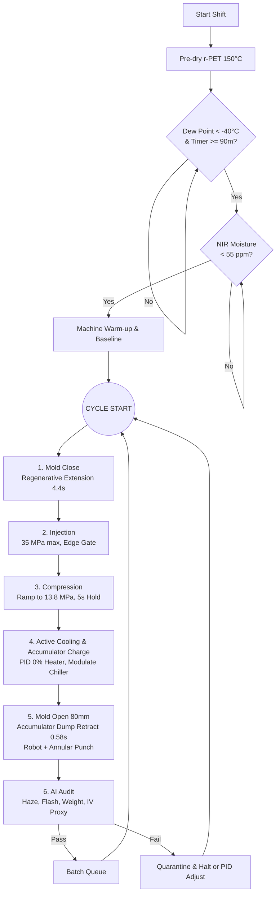
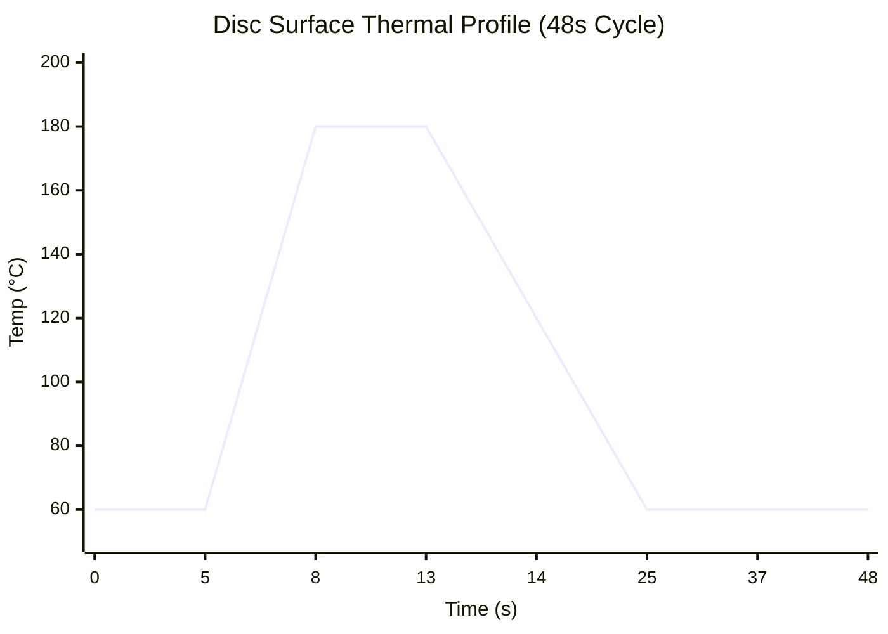
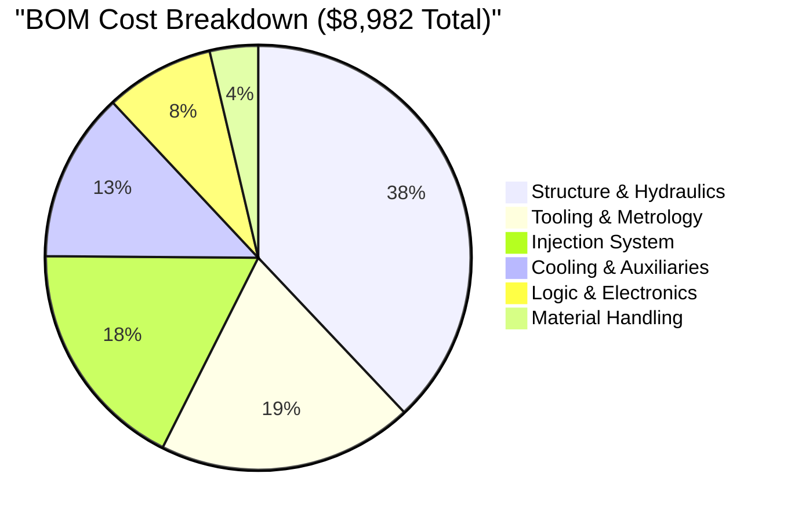
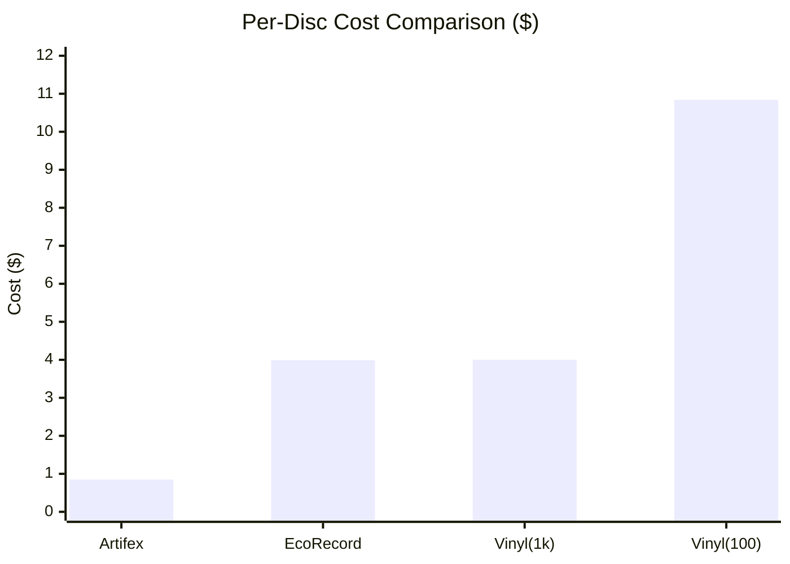

# Artifex Eco‑Press  
## Master Specification — Rev 8.4 FINAL  
**100‑Ton Injection‑Compression | AI‑Supervised | Open‑Source | Modular Hardening**

**May 2026 | Docket AL‑2026‑001‑R8.4 (FINAL)**

> **Supersession:** Rev 8.4 integrates and replaces all previous documents (Rev 8.2 and earlier). This revision resolves the Pre‑Production Critical Technical Audit, implementing an AC Servo injection drive, restoring physically justified screw geometry, standardising thermal cutoffs to 290 °C, integrating a 5‑gallon accumulator for ultra‑fast extraction, and reconciling the Bill of Materials.

---

## 1. Executive Summary
The Artifex Eco‑Press is a 100‑ton, open‑source, AI‑supervised injection‑compression cell that presses audiophile‑grade 12‑inch LP records from 100% recycled PET.

Rev 8.4 is the definitive, mathematically sound specification that:
- Provides a fully verified physics‑compliant base build (**BOM: $8,982**).
- Offers a Production‑Hardened build with Tier 1 upgrades.
- Uses a standard regenerative extension circuit and a 5‑gallon (18.9 L) hydraulic accumulator to achieve an ultra‑fast 80 mm retraction within the 48‑second cycle budget.
- Mandates industrial‑grade safety, strictly enforcing 290 °C manual‑reset thermal cutoffs and dual‑channel E‑Stops.

**Base Build Capability:**
- 12‑inch, 180 g r‑PET records
- ~75 discs/hour (48 s cycle)
- Groove depth 25–50 µm, flatness <1 mm
- Industrial safety: dual‑channel E‑Stop, hardware voice interrupt, guard interlocks, fume extraction
- Power: 240 V / 50 A single‑phase dedicated circuit

---

## 2. Changes from Rev 8.2 (Audit Resolution)
- **R8‑01 (Injection Drive Revision):** NEMA 34 stepper cannot deliver the required 10.5 Nm at 1680 RPM. Replaced with a 1.5 kW AC Servo Motor (130ST‑M10015), providing 25 Nm peak torque and a **138% positive margin** at the target injection velocity.
- **R8‑02 (Screw Geometry):** Restored screw specification to L/D 24:1, compression ratio 2.8:1, and Maddock barrier to ensure complete melting of reduced‑IV r‑PET.
- **R8‑03 (Thermal Standardisation):** All thermal cutoffs standardised to **290 °C** (20 °C margin above the 270 °C PID setpoint) to prevent nuisance trips.
- **R8‑04 (Extraction Geometry):** Mold‑open stroke increased to **80 mm**; a 5‑gallon accumulator delivers the required 5.58 L rod‑end fill in 0.58 s, replacing the physically impossible “bidirectional regenerative retraction”.
- **R8‑05 (BOM Reconciliation):** Stamper (user‑supplied) removed from machine BOM; D6 cartridge heater line items restored.

---

## 3. Workflow and Process Sequence

### 3.1 Theory of Operation: From Pellet to Playable Record
The Artifex Eco‑Press uses **Injection‑Compression Molding** — the same process historically used for optical discs.

1. **Dehumidification & Melting:** r‑PET pellets are predried at 150 °C until dew point < −40 °C for ≥ 90 minutes. The 1.5 kW AC Servo rotates the 35 mm Maddock screw; mechanical shear and 800 W heaters melt the PET into a homogeneous 270 °C liquid.
2. **2 mm “Breathing” Gap:** The hydraulic press stops the mold halves at a precise 2 mm gap before injection.
3. **Low‑Stress Injection:** The servo drives the screw forward, filling the cavity at low back‑pressure. V/P switchover triggers at 95% cavity fill.
4. **100‑Ton Compression Strike:** The ram applies full 13.8 MPa clamp force (1,007 kN), stamping the audio grooves into the cooling plastic.
5. **Amorphous Freezing:** The CW‑5200 chiller pushes coolant through conformal channels (8 mm, 25 mm pitch) in the 7075‑T651 aluminium mold. The disc skin transits from 180 °C to 120 °C in < 1.5 s, locking in an amorphous, glass‑like state.
6. **Accumulator Ejection & AI Audit:** The 5‑gallon accumulator dumps 5.58 L of fluid into the rod‑end, snapping the mold open 80 mm in 0.58 s. The 3‑axis robot extracts and trims the disc, and the Jetson AI camera inspects for haze and flash before final stacking.

### 3.2 Process Flowchart



### 3.3 Step‑by‑Step Cycle Sequence (48 s Total)

```mermaid
gantt
    title Artifex 48-Second Cycle Sequence
    dateFormat  s
    axisFormat %S
    
    section Hydraulics
    Mold Close (Regen)       :a1, 0, 4.5s
    Compression Hold         :a2, 7.5, 5s
    Accumulator Charge       :a3, 12.5, 12s
    Mold Open (Accumulator)  :a4, 24.5, 0.58s
    
    section Process
    Injection (Servo)        :crit, b1, 4.5, 3s
    Active Cooling           :b2, 12.5, 12s
    Robot Extraction & Trim  :b3, 25.08, 11.42s
    AI Audit                 :b4, 36.5, 11.5s
```

**Pre‑Processing:**  
- Pre‑dry r‑PET in desiccant hopper at 150 °C. **Regrind Rule:** Max 15% regrind ratio.  
- Firmware interlock: dew point < −40 °C for ≥90 consecutive minutes.  
- Inline NIR sensor confirms surface moisture <55 ppm.

**Mold Close (0–4.5 s):**  
Regenerative extension traverses 12 inches in ~4.4 s; final 20 mm decelerates to 5 mm/s, stopping at 2 mm gap.

**Injection (4.5–7.5 s):**  
1.5 kW AC Servo at 1680 RPM; 180 g shot in 3 s; V/P switchover at 95% fill. Peak nozzle pressure logged as IV‑degradation proxy.

**Compression & Pack (7.5–12.5 s):**  
Ram ramps to 13.8 MPa (1,007 kN) and holds 5 s. Regenerative connection isolated before pressure build‑up.

**Active Cooling & Accumulator Charge (12.5–24.5 s):**  
Mold heater SSR at 0% duty; chiller modulates coolant. Pump diverts 5 GPM to charge accumulator to 2,500 psi. Cooling hold: 12 s.

**Mold Open & Extraction (24.5–36.5 s):**  
Accumulator unloading valve opens; 5.58 L fluid retracts mold 80 mm in 0.58 s. Robot extracts disc in <2 s, places in heated pneumatic punch (60–80 °C) for gate and centre trim.

**AI Audit & Reset (36.5–48.0 s):**  
Jetson Orin Nano + ELP camera: OpenCV haze/flash detection. HX711 confirms weight 180 g ± 2 g. Nozzle pressure checked against rolling baseline (±5%). Pass → cooling station; fail → quarantine.

---

## 4. Physics & Thermodynamics Verification

### 4.1 Injection Force & Drive Dynamics
- **Barrel:** 35 mm Ø, L/D 24:1, area = 9.62 × 10⁻⁴ m².
- **Required force at 35 MPa:** 33.7 kN.
- **Shot speed:** 180 g in 3 s → linear screw velocity 46.7 mm/s.
- **Kinematics:** 46.7 mm/s ÷ 5 mm/rev = 560 RPM at screw; 3:1 reduction → 1,680 RPM motor.
- **Motor:** 130ST‑M10015 AC Servo, 10 Nm cont. / 25 Nm peak.
- **Linear force at continuous torque:**  
  \(F_{cont} = \frac{2\pi \times 10 \times 3 \times 0.95}{0.005} \times 0.90 = 32.2\ \text{kN}\)
- **Linear force at peak torque:**  
  \(F_{peak} = \frac{2\pi \times 25 \times 3 \times 0.95}{0.005} \times 0.90 = 80.5\ \text{kN}\)
- **Margin:** The 33.7 kN demand requires only ~10.5 Nm from the servo; **138% positive margin** at peak.

### 4.2 Clamp Force & Hydraulic Flow
- **Clamp Force:** 12″ bore at 13.8 MPa → 1,007 kN (~100 metric tons).
- **Accumulator:** Rod‑end fill for 80 mm stroke = 5.58 L. A 5‑gallon (18.9 L) bladder accumulator (2,500 psi op., 1,500 psi precharge) delivers this volume (Boyle’s Law verified).
- **Safety:** A8 Safety Block solenoid bleeds accumulator to tank on any E‑Stop or pump fault.

### 4.3 Thermal Budget



- **Steady‑state heat load:** ~790 W (180 g PET at 270 °C every 48 s).
- **Cooling:** VEVOR CW‑5200 chiller (1,000 W capacity) maintains mold at 60 °C; skin transits 180 °C → 120 °C in <1.5 s.

---

## 5. Electrical Load Analysis & Power Budget
**Requirement:** 240 V / 50 A dedicated circuit (12,000 W capacity).

| Component | Startup Load (W) | Steady‑State Load (W) |
|---|---|---|
| 5 HP Hydraulic Pump | 3,730 | 3,730 (intermittent) |
| Barrel Heaters (4 zones) | 2,700 | 850 |
| Mold Cartridge Heaters (4×100 W) | 400 | 0 (trimmed by melt) |
| VEVOR CW‑5200 Chiller | 750 | 750 |
| AC Servo Drive (1.5 kW) | 1,500 | 300 |
| Annular Punch Heater | 50 | 20 |
| Control Systems & PSUs | 150 | 100 |
| Robot Gantry (3× NEMA 23) | 200 | 200 |
| Fume Extraction Fan | 50 | 50 |
| **TOTAL** | **9,530 W (39.7 A)** | **6,000 W (25.0 A)** |

9,530 W startup is within the 12,000 W circuit limit (20.6% headroom). Steady‑state cost: ~$0.72/h at $0.12/kWh.

---

## 6. Modular Hardening Upgrades

**Tier 1 (Production‑Hardened Build Additions)**  
*(Hardware Voice‑Interrupt is standard on all builds)*

| Upgrade | Cost | Function |
|---|---|---|
| In‑line NIR Pellet Moisture Sensor | $850 | Real‑time surface moisture; cycle blocked if >55 ppm |
| DLC Groove Armour Stamper Coating | $180 | 5–10× stamper life extension (PECVD ≤200 °C) |
| **Tier 1 Subtotal** | **$1,030** | |
| **Production‑Hardened Total** | **$10,012** | |

---

## 7. Complete Granular Bill of Materials (Rev 8.4) — $8,982



### Section A — Heavy Structure & Hydraulics ($3,410)
| Item | Description | Cost |
|---|---|---|
| A1 | Used 100‑ton 4‑post press (12″ bore, 12″ stroke, 2.5″ rod) *surplus* | $1,500 |
| A2 | 5 HP (3.7 kW) HPU, 5 gpm pump, 50 L reservoir | $750 |
| A3 | 4/3 proportional spool valve (Cetop 5) + manifold (regen ext.) | $300 |
| A3.1 | Proportional valve amplifier/driver module | $150 |
| A4 | Pressure relief valve, 2,000 psi | $80 |
| A5 | Burst disc assembly, 3,000 psi | $40 |
| A6 | Hydraulic hose & fitting kit (3,000 psi) | $150 |
| A7 | **5‑gallon (18.9 L) bladder accumulator, 3,000 psi** | $250 |
| A8 | Accumulator Safety Block (manual + solenoid bleed) | $190 |

### Section B — Injection System 3:1 Belt Drive ($1,590)
| Item | Description | Cost |
|---|---|---|
| B1 | 35 mm screw (L/D 24:1, Maddock, CR 2.8:1) + bimetallic barrel + 3×800 W heaters + nozzle | $950 |
| B5 | 1.5 kW AC Servo & Drive Kit (130ST‑M10015) | $250 |
| B7 | 5 mm lead ball screw (C7) + nut, 200 mm travel | $80 |
| B8 | Ball screw bearing blocks (BK/BF) | $40 |
| B9 | Injection unit mounting frame (steel plate + angle iron) | $50 |
| B11 | 3:1 HTD timing belt reduction kit | $40 |
| B12 | Manual slide screen changer (35 mm) for r‑PET filtration | $180 |

### Section C — Material Handling ($330)
| Item | Description | Cost |
|---|---|---|
| C1 | Desiccant air dryer (2 kg, 150 °C) | $100 |
| C2 | Stainless steel hopper (2 kg) with slide gate | $50 |
| C3 | Melt pressure transducer, 0–2,000 bar, ½‑20 UNF | $80 |
| C4 | In‑line dew‑point sensor (−60 °C to +20 °C, 4–20 mA) | $100 |

### Section D — Tooling & Metrology ($1,747)
| Item | Description | Cost |
|---|---|---|
| D1 | P20 steel mold base (12″×12″×2″) with guide pillars | $480 |
| D2 | 7075‑T651 aluminium cavity block (conformal‑cooled, edge‑gate) | $600 |
| D3 | CrN‑coated stamper retainer ring (12″ OD) | $180 |
| D4 | Modified pneumatic punch (annular cutter, heated die 60–80 °C) | $280 |
| D5 | Mold coolant fittings | $30 |
| D6 | 400 W cartridge heaters, ¼″×150 mm, 240 V (4 pcs) | $72 |
| D7 | Granite surface plate (9×12″, Grade B) | $50 |
| D8 | HX711 load cell + digital scale (0–500 g, 0.1 g) | $55 |

> **Stamper (user‑supplied):** Electroformed nickel, 12.000″ OD, 0.300 mm thickness. Not included in machine BOM. DLC coating (Tier 1 upgrade, $180) extends life 5–10×.

### Section E — Logic, Electronics & Sensors ($745)
| Item | Description | Cost |
|---|---|---|
| E1 | Jetson Orin Nano 4 GB module + carrier | $250 |
| E2 | Arduino Portenta H7 | $100 |
| E3 | Teensy 4.0 + I2S MEMS mic (voice interrupt) | $35 |
| E4 | Surplus safety relay (dual‑channel, e.g. MSR127T) | $60 |
| E5 | SSRs (5×) + contactors (2×, 30 A, 240 V coil) | $95 |
| E6 | Meanwell 24 V 15 A PSU (SE‑350‑24) | $50 |
| E7 | Meanwell 12 V 5 A PSU (SE‑60‑12) | $30 |
| E8 | Linear encoder (1 µm, 200 mm, renishaw/surplus) + rotary encoder | $80 |
| E9 | 290 °C manual‑reset thermal cutoffs (4 pcs) | $45 |

### Section F — Cooling & Auxiliaries ($1,160)
| Item | Description | Cost |
|---|---|---|
| F1 | VEVOR CW‑5200 chiller (1,000 W cooling) | $350 |
| F2 | AC Infinity CLOUDLINE T6 fume fan + carbon/HEPA filter + ducting | $150 |
| F3 | Polycarbonate safety guarding (6 mm Lexan, 4 sheets) + frame | $150 |
| F4 | V‑slot 3‑axis Cartesian gantry kit (400×300×150 mm) | $300 |
| F5 | Vacuum cup end‑effector + venturi generator + valve | $50 |
| F6 | Active disc cooling station (fan + HEPA filter) | $60 |
| F7 | Critical spares (thermocouples, fuses, etc.) | $100 |

**FINAL BASE BOM TOTAL: $8,982**

---

## 8. Firmware, Safety & Software Architecture

### 8.1 Safety Hardware Locks
- **Primary:** Dual‑channel E‑Stop buttons and guard interlocks → safety relay → drops KM1 (pump) and heater SSRs within **100 ms**.
- **Hydraulic:** A8 Safety Block solenoid wired to safety relay auxiliary contact; any trip automatically bleeds accumulator to tank.
- **Voice Interrupt (Supplementary):** Teensy 4.0 hardware comparator pulls Portenta ISR low in **<100 µs** on detected “STOP”. KM1 drops immediately.
- **Thermal Cutoffs:** Four independent 290 °C bimetallic cutoffs physically interrupt heater circuits. Manual reset required. Portenta logs `FAULT_THERMAL_CUTOFF`.
- **Latching Rule:** Any interlock trip latches the machine locked. Only a physical, illuminated hardware RESET button can re‑enable. Firmware will **never** auto‑re‑energize KM1.

### 8.2 Communication
Portenta H7 ↔ Jetson Orin Nano: **UART4, 920 kbps**, structured JSON packets.  
Per‑cycle variables: `cycle_id`, `dew_point`, `nir_moisture`, `b_zone1_temp` … `b_zone4_temp`, `m_temp`, `close_time`, `inj_peak_pressure`, `shot_weight`, `ai_haze_score`, `ai_flash_detected`, `reject_code`.

---

## 9. Commissioning & Acceptance Protocol

**Phase 1 – Safety Verification:**
- E‑Stop: all motion & heaters off within **100 ms**.
- Voice “STOP”: KM1 drops within **100 µs** (oscilloscope).
- Thermal cutoffs: each trips at 290 °C ± 5 °C; manual reset required; Portenta logs FAULT.
- Accumulator E‑Stop test: A8 Safety Block bleeds to tank within **2 s**.

**Phase 2 – Hydraulic & Mechanical Accuracy:**
- Full 12‑inch traverse in ~4.4 s (regenerative extension).
- Accumulator retraction to exactly 80 mm gap in **<1 s** (0.58 s theoretical) without pump cavitation.

**Phase 3 – Thermal Stability:**
- Mold reaches 60 °C within 15 min using 400 W startup heaters.
- Barrel zones stabilise to ±2 °C of 270 °C setpoint within 30 min cold start.

**Phase 4 – Nozzle Baseline:**  
20‑shot run to establish IV‑proxy nozzle pressure baseline.

**Phase 5 – Continuous Run:**  
20‑disc run at strict 48 s cycle, no operator intervention, no thermal runaway, all discs 180 g ± 2 g, haze index <0.05.

---

## Appendix C: What Not To Do (Design Anti‑Patterns)

| Anti‑Pattern | Reason Rejected |
|---|---|
| Stepper motor for injection drive | Cannot deliver 10.5 Nm at 1,680 RPM; will stall. AC Servo mandatory. |
| L/D 20:1 screw with 2.5:1 CR | r‑PET does not fully melt before the Maddock barrier; pellets fail to compact. L/D 24:1, CR 2.8:1 required. |
| Stamper as machine BOM line item | User‑produced to master lacquer; conflates machine scope with per‑production cost. |
| Mold‑open stroke <80 mm | Robot end‑effectors physically cannot clear. Accumulator dump required. |
| Bidirectional regenerative retraction | Physically impossible for retraction strokes. Accumulator supplies the required 5.58 L rod‑end fill. |
| 2.5‑gallon accumulator | Boyle’s Law: only ~3.8 L usable between 2,500 psi op. and 1,500 psi precharge. 5‑gallon mandatory. |
| Thermal cutoffs at 280 °C | 5 °C margin over 270 °C setpoint causes nuisance trips. 290 °C provides safe margin. |

---

## 10. Production Cost Economics

### 10.1 Per‑Disc Variable Cost Model
(75 discs/hour, $0.12/kWh Seattle commercial rate, r‑PET $1.21/kg, 50,000‑disc amortisation)

| Cost Component | Calculation | Cost/Disc |
|---|---|---|
| r‑PET Material | 0.180 kg × $1.21/kg | $0.218 |
| Process Energy | 1.1 kWh/kg × 0.18 kg × $0.12/kWh | $0.024 |
| Stamper (DLC‑coated) | $350/pair ÷ 10,000 discs | $0.035 |
| Labour (robot‑assisted) | ~5 min operator/75 discs @ $25/h | $0.330 |
| Overhead & Maintenance | $5/h ÷ 75 dph | $0.067 |
| Capex Amortisation | $8,982 ÷ 50,000 discs | $0.180 |
| **TOTAL** | | **~$0.85** |

### 10.2 Comparator Analysis



| Production Method | Quantity | Per‑Disc Cost | vs. Artifex |
|---|---|---|---|
| **Artifex Eco‑Press** | 50,000 lifetime | **$0.85** | — |
| GGR EcoRecord (outsourced PET) | 1,000 | $3.99 | +369% |
| Commercial press plant | 1,000 | ~$4.00 | +370% |
| Commercial press plant | 100 | ~$10.84 | +1,175% |
| Viryl WarmTone (industrial) | Capital only | ~$205,000 | N/A |

### 10.3 Break‑Even Analysis

| Selling Price | Break‑Even Discs | Break‑Even Days (8 h/day) | Gross Margin |
|---|---|---|---|
| $8/disc | ~1,256 | ~2.0 | 89.3% |
| $12/disc | ~805 | ~1.3 | 92.9% |
| $18/disc | ~523 | ~0.8 | 95.2% |
| **$25/disc** | **~361** | **~0.6** | **96.6%** |

At $25/disc (typical audiophile LP retail), the machine capital is recovered in **0.6 production days** — fewer than 500 discs.

---

## 11. Vinyl Market Context & Commercial Positioning
Injection‑moulded PET records are an established commercial category (Gotta Groove EcoRecords at $3.99/disc per 1,000 units). Symcon’s research demonstrated 65% process energy reduction; Green Vinyl Records validated 90% reduction at commercial scale. The traditional PVC vinyl record carries a carbon footprint of ~1.15 kg CO₂ per disc; Artifex’s recycled PET and efficient process cut that by **~85%**.

For independent artists and small labels pressing 500–2,000 discs per release, Artifex transforms the economics from an outsourcing model ($3.99–$7.87/disc) to a **marginal‑cost manufacturing model ($0.85/disc)** — with capital recovered in less than one production day.

---

## 12. Cost‑Benefit Analysis: Artifex vs. Traditional PVC Pressing

| Metric | Artifex Eco‑Press | Traditional PVC Press | Key Advantage |
|---|---|---|---|
| **CapEx** | $8,982 | $150k–$250k | ~95% cheaper |
| **Per‑Disc Variable Cost** | $0.85 | $3.50–$4.00 | 4–5× cheaper |
| **Throughput** | 75 dph (48 s cycle) | 30–45 dph (80–120 s) | 1.7–2.5× higher output |
| **Energy/Disc** | ~0.20 kWh (~$0.02) | 0.54–0.90 kWh (~$0.06–$0.11) | 60–80% less energy |
| **CO₂/Disc** | ~0.07 kg | ~0.55 kg | ~8× lower carbon footprint |
| **Material Cost** | r‑PET $1.21/kg | Virgin PVC ~$1.80/kg | ~30% raw savings |
| **Stamper Life** | 10,000+ (DLC coated) | 5,000–10,000 | Similar amortisation |
| **Break‑Even @ $25/disc** | ~361 discs (~0.6 days) | ~2,500 discs (~2 days) | 5× faster recovery |
| **Personnel** | 1 operator + robot | 2–3 operators | Reduced labour |
| **Safety** | 100‑ton, ISO 13849‑1 compliant | Up to 300‑ton | Lower stored energy |

---

## 13. References
1. Microforum – Small Run (100 records): $5–$10 per unit · Large Run: $1.00+
2. ECO‑RECORDS (INJECTION MOLDED PET RECORDS)
3. Global Vinyl Records Market Size, Share, Trends and Forecast 2026. 9% CAGR from 2026–2032.
4. Vinyl Sales Surpassed $1 Billion In 2025: Report – Forbes.
5. Injection‑molded vinyl could offer better sound and lower costs (Symcon).
6. Vinyl injection‑moulding technology promises to slash costs and improve quality (Green Vinyl Records).
7. Impact of the proportion between virgin and recycled polyethylene... (MOPET Intrinsic Viscosity).
8. Recycled PET Prices Q4 2025 | Index & Forecast Data – LinkedIn.
9. Energy Management in Plastics Processing – Tangram Technology (Injection moulding: 0.9 to 1.6 kWh/kg).
10. VINYL RECORD INDUSTRY – First carbon footprinting report.

---

## Appendix D: Builder’s Procurement & Materials Checklist

### Section A – Heavy Structure & Hydraulics

| # | Item | Qty | Source / Specification | ☐ |
|---|---|---|---|---|
| A1 | Used 100‑ton 4‑post press (12″ bore, 12″ stroke, 2.5″ rod) *surplus* | 1 | eBay, HGR Industrial, machinery auctions | ☐ |
| A2 | 5 HP single‑phase HPU (5 gpm pump, 50 L reservoir) | 1 | Surplus Center, VEVOR, local surplus | ☐ |
| A3 | 4/3 proportional spool valve (Cetop 5) + manifold | 1 set | Bosch Rexroth, Parker, surplus | ☐ |
| A3.1 | Proportional valve amplifier/driver module | 1 | Same source as valve | ☐ |
| A4 | Pressure relief valve, 2,000 psi | 1 | McMaster‑Carr | ☐ |
| A5 | Burst disc assembly, 3,000 psi | 1 | McMaster‑Carr | ☐ |
| A6 | Hydraulic hose & fitting kit (NPT/JIC, 3,000 psi) | 1 lot | Local hydraulic shop | ☐ |
| A7 | **5‑gallon (18.9 L) bladder accumulator, 3,000 psi** | 1 | Parker, eBay surplus | ☐ |
| A8 | Accumulator safety block (manual + solenoid bleed‑off) | 1 | Same supplier as accumulator | ☐ |
| — | M16 anchor bolts (150 kN shear rated) | 4–6 pcs | Concrete anchors, local hardware | ☐ |
| — | Hydraulic fluid ISO VG 46, 20 L | 1 drum | Local supplier | ☐ |

### Section B – Injection System (3:1 Belt Drive)

| # | Item | Qty | Source / Specification | ☐ |
|---|---|---|---|---|
| B1 | 35 mm screw (L/D 24:1, Maddock, CR 2.8:1) + bimetallic barrel + 3×800 W heaters + nozzle | 1 set | Factory direct (Alibaba, Xaloy OEM) | ☐ |
| B5 | 1.5 kW AC Servo & Drive Kit (130ST‑M10015, 10 Nm, 1500 RPM, 240V single‑phase) | 1 set | StepperOnline, AliExpress factory direct | ☐ |
| B7 | 5 mm lead rolled ball screw (C7) + nut, 200 mm travel | 1 | Misumi, Thomson, AliExpress | ☐ |
| B8 | Ball screw bearing blocks (BK/BF) | 1 set | Same source as screw | ☐ |
| B9 | Injection unit mounting frame (steel plate + angle iron) | 1 lot | Local steel supplier, weld‑up | ☐ |
| B11 | 3:1 HTD timing belt reduction kit (pulleys, belt, tensioner) | 1 set | Misumi, OpenBuilds | ☐ |
| B12 | Manual slide screen changer (35 mm) for r‑PET filtration | 1 | Xaloy, local plastics auxiliary supplier | ☐ |
| — | Spare 800 W band heater | 1 | Omega, McMaster‑Carr | ☐ |
| — | Spare Type‑K thermocouples (barrel) | 2 | Omega | ☐ |

### Section C – Material Handling & Moisture Defence

| # | Item | Qty | Source / Specification | ☐ |
|---|---|---|---|---|
| C1 | Desiccant air dryer (2 kg, 150 °C) | 1 | Dri‑Air, eBay, Amazon | ☐ |
| C2 | Stainless steel hopper (2 kg) with slide gate | 1 | Amazon, local fabrication | ☐ |
| C3 | Melt pressure transducer, 0–2,000 bar, ½‑20 UNF | 1 | eBay, plastics auxiliary suppliers | ☐ |
| C4 | In‑line dew‑point sensor (−60 °C to +20 °C, 4–20 mA) | 1 | Omega, Digi‑Key | ☐ |
| *Tier 1* | In‑line NIR moisture sensor (MoistTech IR‑3000 or PolyMoist) | 1 | $850, contact manufacturer | ☐ |

### Section D – Tooling & Metrology

| # | Item | Qty | Source / Specification | ☐ |
|---|---|---|---|---|
| D1 | P20 steel mold base (12″×12″×2″) with guide pillars & alignment blocks | 1 | Misumi, DME, local CNC | ☐ |
| D2 | 7075‑T651 aluminium cavity block (conformal‑cooled, edge‑gate, label recess) | 1 | Xometry, Protolabs, local CNC | ☐ |
| D3 | CrN‑coated stamper retainer ring (12″ OD) | 1 | Local PVD coating shop | ☐ |
| D4 | Modified pneumatic punch (annular cutter, heated die 60–80 °C) | 1 set | AutomationDirect cylinder + custom cutter | ☐ |
| D5 | Mold coolant fittings (½″ BSP push‑fit or ⅜″ NPT) | 1 lot | McMaster‑Carr | ☐ |
| D6 | 400 W cartridge heaters, ¼″×150 mm, 240 V (4 units) | 4 pcs | Omega, Tempco | ☐ |
| D7 | Granite surface plate (9×12″, Grade B) | 1 | Amazon, MSC | ☐ |
| D8 | HX711 load cell + digital pocket scale (0–500 g, 0.1 g) | 1 set | SparkFun + Amazon scale | ☐ |
| — | **Nickel stamper (user‑supplied)** 12.000″ OD, 0.300 mm | 1 | Electroforming service, user responsible | ☐ |
| *Tier 1* | DLC coating service for stamper (PECVD ≤200 °C) | 1 job | Approved coating house | ☐ |

### Section E – Logic, Electronics & Sensors

| # | Item | Qty | Source / Specification | ☐ |
|---|---|---|---|---|
| E1 | Jetson Orin Nano 4 GB module + carrier board | 1 set | NVIDIA, Seeed Studio | ☐ |
| E2 | Arduino Portenta H7 | 1 | Arduino official, Mouser | ☐ |
| E3 | Teensy 4.0 + I2S MEMS microphone (SPH0645LM4H) | 1 set | PJRC, Adafruit | ☐ |
| E4 | Surplus safety relay (dual‑channel, e.g. Allen‑Bradley MSR127T) | 1 | eBay, machinery surplus | ☐ |
| E5 | Solid state relays (5×, 40 A, 240 V) + contactors (2×, 30 A, 240 V coil) | 1 lot | AutomationDirect, Digi‑Key | ☐ |
| E6 | Meanwell 24 V 15 A PSU (SE‑350‑24) | 1 | Digi‑Key, Mouser | ☐ |
| E7 | Meanwell 12 V 5 A PSU (SE‑60‑12) | 1 | Digi‑Key, Mouser | ☐ |
| E8 | Linear encoder (1 µm, 200 mm range) + rotary encoder | 1 set | Renishaw, eBay surplus | ☐ |
| E9 | 290 °C manual‑reset thermal cutoffs (bimetallic, series loop) | 4 | Omega, McMaster‑Carr | ☐ |
| E10 | ELP 1080p USB camera (disc AI audit) | 1 | Amazon | ☐ |
| E11 | OLED display (128×64, I²C) + pushbuttons/status LEDs | 1 lot | Adafruit, Amazon | ☐ |
| E12 | Wiring, DIN rail, terminals, shielded cables, conduit | 1 lot | Local electrical supply | ☐ |

### Section F – Cooling & Auxiliaries

| # | Item | Qty | Source / Specification | ☐ |
|---|---|---|---|---|
| F1 | VEVOR CW‑5200 chiller (1,000 W) | 1 | Amazon, VEVOR direct | ☐ |
| F2 | AC Infinity CLOUDLINE T6 fan + carbon/HEPA filter + ducting | 1 set | Amazon | ☐ |
| F3 | Polycarbonate safety guarding (6 mm Lexan, 4 sheets) + extrusion frame | 1 lot | ePlastics, local plastic shop | ☐ |
| F4 | Generic V‑slot 3‑axis Cartesian gantry kit (400×300×150 mm) | 1 set | OpenBuilds, Sienci | ☐ |
| F5 | Vacuum cup end‑effector (20 mm silicone) + venturi vacuum gen. + pneumatic valve | 1 set | Festo, SMC, Amazon | ☐ |
| F6 | Active disc cooling station (fan + HEPA filter) | 1 | Amazon / DIY | ☐ |
| F7 | Critical spares kit (thermocouples, fuses, suction cups, thermal cutoffs) | 1 lot | As per BOM | ☐ |
| F8 | 40 A / 240 V disconnect switch + enclosure | 1 | AutomationDirect, Home Depot | ☐ |

### Installation Consumables (Not in BOM but required)

| Item | Qty | Note |
|---|---|---|
| Concrete anchor bolts M16 × 150 mm | 4–6 | For press frame |
| Metallic conduit & fittings (for 240 VAC wiring) | 1 lot | Local electrical code |
| Threadlocker, anti‑seize, PTFE tape | as needed | Assembly |
| Cable ties, heat shrink, ring terminals | 1 lot | Wiring |
| Silicone sealant (high‑temp) | 1 tube | Nozzle assembly |
| Compressed air supply (shop air) | external | For punch & vacuum |

### Recommended Tools & Test Equipment

| Tool | Purpose |
|---|---|
| True RMS multimeter | Electrical verification |
| Oscilloscope (≥50 MHz) | Dither signal, encoder noise |
| Hydraulic pressure gauge (0–3,000 psi) | Commissioning |
| Calibrated heat gun / thermocouple calibrator | Thermal cutoff testing |
| Digital caliper / micrometer | Mechanical alignment |
| Laptop with Arduino IDE, PlatformIO, NVIDIA SDK | Firmware/software upload |

---

## 14. Revision History

| Rev | Date | Key Changes |
|---|---|---|
| **8.4 (FINAL)** | **May 2026** | **AC Servo replaces stepper (R8‑01). L/D 24:1, CR 2.8:1 restored (R8‑02). Thermal cutoffs standardised at 290 °C (R8‑03). 80 mm mold stroke + 5‑gallon accumulator (R8‑04). Stamper removed from BOM; D6 heaters restored (R8‑05). BOM final: $8,982. New: Theory of Operation, Mermaid flowcharts, Cost‑Benefit Analysis, Builder’s Procurement Checklist, Design Anti‑Patterns.** |
| 8.3 | May 2026 | AC Servo substitution; L/D and CR corrections; thermal margin audit. |
| 8.2 | Apr 2026 | Pre‑production draft. Critical errors in injection drive, mold stroke, and thermal margins. Fully superseded. |

---

*Open‑source design. All specifications, calculations, and BOM items are provided for educational and build purposes. Builders assume full responsibility for local electrical, hydraulic safety, and manufacturing compliance. Docket AL‑2026‑001‑R8.4 (FINAL).*

---

## Appendix E: Agent Action Plan (Software Architecture)

# Artifex Eco-Press — Agent Action Plan

## 0.1 Product Understanding
Based on the prompt, the Blitzy platform understands that the new product is the Artifex Eco-Press Rev 8.3/8.4 FINAL — an open-source, AI-supervised, 100-ton injection-compression manufacturing cell that presses audiophile-grade 12-inch LP records from 100% recycled PET (r-PET). The deliverable for this Agent Action Plan is the complete software, firmware, and documentation artefact set that brings the specified hardware build into a production-ready, safety-certified, ISO 13849-compliant operating system executing a strict 48-second cycle at 75 discs/hour.

### 0.1.1 Core Product Vision
The Artifex Eco-Press is a pre-engineered, pre-costed cyber-physical manufacturing platform targeted at independent artists, small labels, and eco-focused brands. It transitions vinyl production economics from a per-run outsourcing model ($3.99–$7.87/disc) to a marginal-cost manufacturing model ($0.85/disc), with capital recoverable in less than one production day at typical retail pricing.

**Functional Requirements (Technically Restated):**
* **FR-01 — Cycle Orchestration:** The software shall execute a deterministic 48-second production cycle composed of six sequential phases without operator intervention.
* **FR-02 — Hydraulic Control:** The firmware shall drive the 4/3 proportional spool valve through three distinct modes per cycle.
* **FR-03 — Injection Drive Control:** The firmware shall command the 1.5 kW AC Servo (130ST-M10015) to rotate the 35 mm ball-screw at 1680 RPM.
* **FR-04 — Thermal Regulation:** A multi-zone PID controller shall maintain barrel heaters and hold the mold at 60°C.
* **FR-05 — Pre-Production Gating:** Dew-point sensor confirms < -40°C for >= 90 mins AND NIR sensor confirms surface moisture < 55 ppm.
* **FR-06 — AI Quality Audit:** A computer-vision pipeline shall analyze each ejected disc via the ELP 1080p camera for haze and flash using OpenCV.
* **FR-07 — Data Logging:** Every cycle shall log a structured JSON packet.
* **FR-08 — Reject Handling:** Failed audits shall trigger quarantine routing.
* **FR-09 — Extraction Choreography:** 3-axis Cartesian gantry extraction control.

**Non-Functional Requirements:**
* **NFR-01 — Safety (Priority: P0):** ISO 13849-1 Category 3 / Performance Level d.
* **NFR-02 — Latching Fault Semantics:** Interlock trips require physical RESET.
* **NFR-03 — Real-Time Determinism:** Sub-millisecond cycle-timing determinism.
* **NFR-04 — Throughput:** Sustained 48-second cycle time.
* **NFR-05 — Inter-Processor Communication:** Portenta H7 (M7) and Jetson communicate over UART4 at 920 kbps (JSON).
* **NFR-06 — Power Envelope:** Coincident load must not exceed 9,530 W.

### 0.1.2 Technology Stack
* **Microcontroller:** Arduino Portenta H7 (Cortex-M7 + Cortex-M4)
* **Edge AI:** NVIDIA Jetson Orin Nano 4GB module
* **Voice Safety:** Teensy 4.0 + I2S Mic
* **Safety Relay:** Pilz PNOZ X2.1
* **Vision Library:** OpenCV (blob/contour detection)
* **Languages:** C/C++ (Arduino/Mbed, Teensyduino), Python 3.10 (Jetson)

## 0.3 Technical Architecture Design
The Artifex Eco-Press software stack is a hierarchical three-tier distributed control architecture with a hardwired safety substrate.

* **L3 — Supervisor (Jetson Orin Nano):** Python 3.10, OpenCV 4.12, FastAPI, SQLite
* **L2 — Real-Time Controller (Portenta H7 M7):** C++17 on Arduino Mbed Core
* **L2 — PID / SSR / ISRs (Portenta H7 M4):** C++ on Mbed pinned to deterministic tasks
* **L1 — Voice Safety (Teensy 4.0):** C++ on Teensyduino + Audio Library
* **L0 — Hardwired Safety:** Pilz PNOZ X2.1 + 290°C bimetallic cutoffs

## 0.5 Repository Structure Planning
A polyglot monorepo structure separating firmware (Portenta, Teensy) and supervisor software (Jetson), sharing common JSON schemas.

### 0.5.1 Proposed Directory Tree
* `/firmware/portenta_h7/` (Cycle FSM, PID, Safety, Comms)
* `/firmware/teensy_40/` (Voice Keyword Stop)
* `/jetson/` (Python Orchestrator, OpenCV Vision, HMI, SQLite Logger)
* `/schemas/` (Single Source of Truth JSON schemas for code-generation)
* `/config/` (YAML configurations)
* `/hardware/` (BOMs, Schematics, Pinmaps)
* `/docs/` (Architecture, Operator Runbook, Commissioning)
* `/scripts/` (Build and Flash scripts)

## 0.7 Deliverable Mapping & Phases

* **Phase F0 — Foundation:** Repo skeleton, config files, schema codegen, and CI setup.
* **Phase F1 — Core Logic:** Portenta FSM skeleton, Teensy audio capture, Jetson orchestrator skeleton.
* **Phase F2 — Interfaces:** Drivers, OpenCV pipeline, SQLite DB, HMI.
* **Phase F3 — Testing:** Unity/Ceedling tests, Python pytest, commissioning wrappers.
* **Phase F4 — Documentation:** Runbooks, maintenance guides, architecture.
* **Phase F5 — Release Hardening:** SBOMs, signed artefacts.
